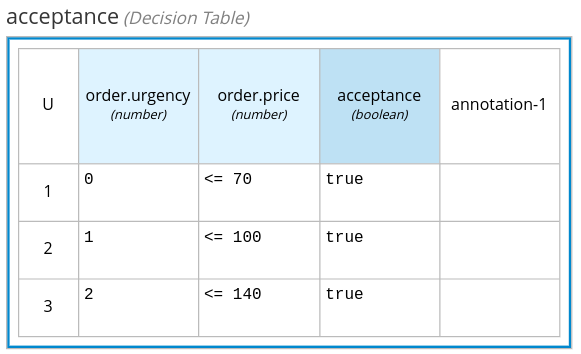

# Order Kogito Project

This project uses Quarkus, the Supersonic Subatomic Java Framework and Kogito.

Learn more at:

- https://quarkus.io/
- https://kogito.kie.org/

## Order Process

The Order process is a classical asset procurement process (aka Request for Quotation):

- It’s triggered by an **internal demand** e.g. an employee requires a new phone
- The first task performs an **Inventory Check** for the item availability (external system call)
- **Purchase Order Creation**: a clerk in the purchasing department evaluates the demand and the item availability in the inventory, finally decide whether or not to forward the Purchase Order to the supplier for a quotation
- **Supplier quotation**: the supplier replies with an offer (set price in the order form)
- **Automatic Acceptance**: the offer can be automatically approved according to a set of business rules defined with the DMN notation
- **Offer Acceptance**: if the offer was rejected by the DMN logic, the clerk in the purchase department will evaluate the offer and decide whether to accept or reject.


### Inventory Check

This task is a placeholder for an external system integration: it represents the call to an inventory system which returns the item availability in the stock.
The current implementation is a Java class with a trivial logic: if the item is "phone" then return 2 otherwise 0.

## Acceptance Decision

The acceptance decision is pretty straightforward:


The Decision Requirement Diagram shows that the acceptance logic is inside the acceptance node and it's based on the information provided by order data: urgency and price.

Acceptance node contains 3 rules in a decision table form:

- when *urgency* is 0 and *price* is lower or equal to 70 the acceptance is *true*
- when *urgency* is 1 and *price* is lower or equal to 100 the acceptance is *true*
- when *urgency* is 2 and *price* is lower or equal to 140 the acceptance is *true*



In all other cases, acceptance is false since the defaut outcome is set to false of the acceptance column.

## Running the process in dev mode

You can run your application in dev mode that enables live coding using:

```shell
./mvnw compile quarkus:dev
```

You can run the process management UI from Dev UI: http://localhost:8080/q/dev/.


## Packaging and running the application

The application can be packaged using:

```shell
./mvnw package
```

It produces the `quarkus-run.jar` file in the `target/quarkus-app/` directory.
Be aware that it’s not an _über-jar_ as the dependencies are copied into the `target/quarkus-app/lib/` directory.

If you want to build an _über-jar_, execute the following command:

```shell
./mvnw package -Dquarkus.package.type=uber-jar
```

The application is now runnable using `java -jar target/quarkus-app/quarkus-run.jar`.

## Creating a native executable

You can create a native executable using: 

```shell
./mvnw package -Pnative
```

Or, if you don't have GraalVM installed, you can run the native executable build in a container using: 

```shell
./mvnw package -Pnative -Dquarkus.native.container-build=true
```

You can then execute your native executable with: `./target/order-kogito-1.0.0-SNAPSHOT-runner`

If you want to learn more about building native executables, please consult https://quarkus.io/guides/maven-tooling.html.